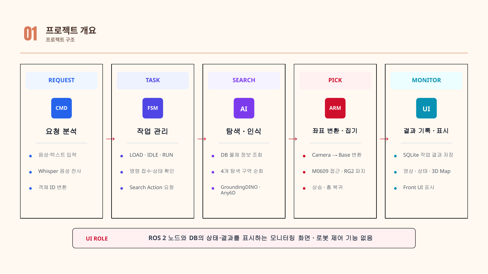
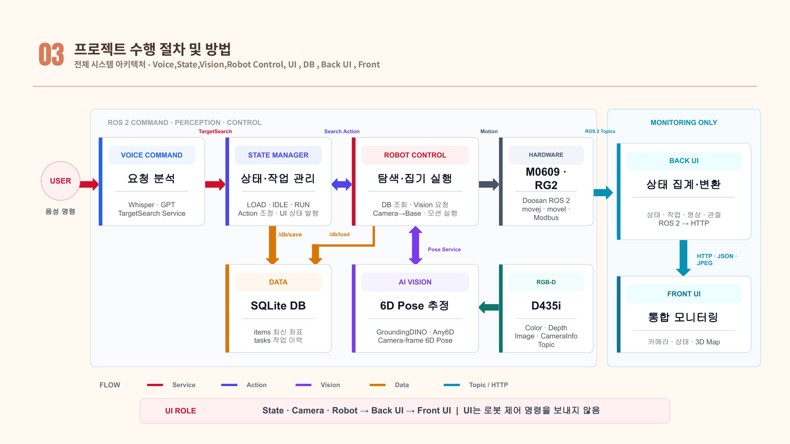
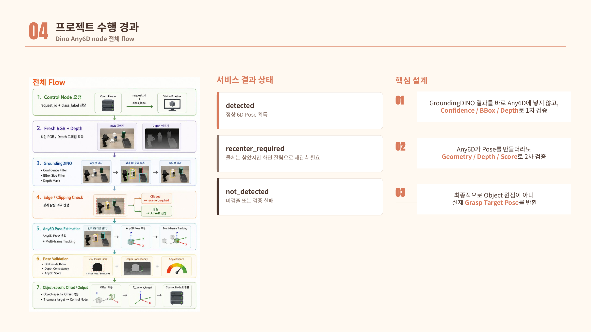
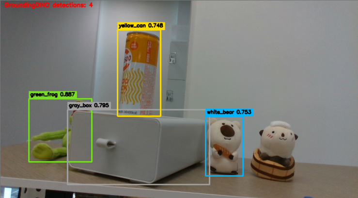
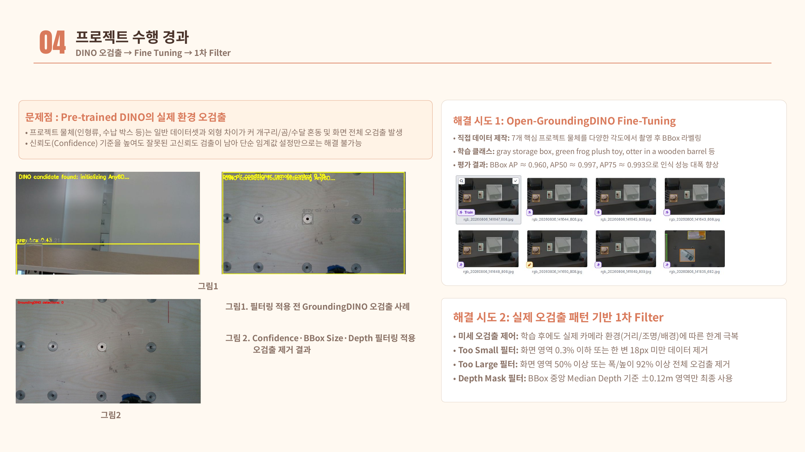
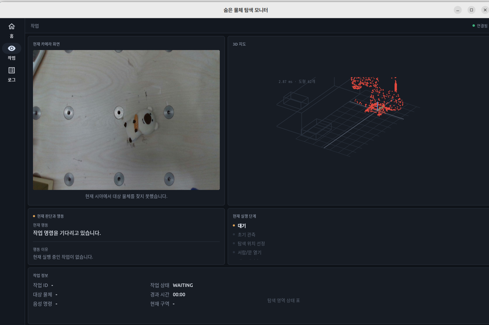

<div align="center">

# 🔎 찾아봇 (FindBot)

### AI Vision 기반 능동 탐색 협동로봇 어시스턴트

**“위치를 몰라도, 원하는 물체를 스스로 찾아 집어주는 AI 협동로봇”**

<p>
  
  
  
  
  
</p>
<p>
  
  
  
  
  
</p>

<br/>

<table>
<tr>
<td align="center" width="50%">
  
</td>
<td align="center" width="50%">
  
</td>
</tr>
</table>

<br/>

[🗄️ **Box Opening Demo**](#demo) ·
[🤖 **Search & Pick Demo**](#demo) ·
[🧭 **시스템 구조**](#system-architecture) ·
[👁️ **Vision**](#vision) ·
[🖥️ **Monitoring UI**](#monitoring-ui)

</div>

---

## 📌 Project Overview

**찾아봇**은 사용자가 음성으로 원하는 물체를 요청하면, **Doosan M0609 협동로봇이 주변을 능동적으로 탐색하고 물체를 찾아 파지하는 ROS 2 프로젝트**입니다.

단순히 카메라 화면에 보이는 물체를 검출하는 데서 끝나지 않습니다. DB에 저장된 마지막 위치를 우선 확인하고, 대상이 보이지 않으면 여러 탐색 구역을 이동하며 **서랍·보관함을 열어 내부를 다시 관측**합니다. 이후 GroundingDINO와 Any6D로 대상의 위치와 자세를 추정하고, MoveIt 2를 이용해 충돌을 검사한 뒤 RG2 그리퍼로 파지합니다.

작업 상태, 현재 탐색 단계, 카메라 영상, 물체 위치, 로봇 자세와 작업 이력은 별도의 **관측 전용 Flet 대시보드**에서 확인할 수 있습니다.

> **핵심 포인트**  
> “물체 인식”뿐 아니라 **탐색 → 재관측 → 6D Pose 검증 → 파지 → 상태 기록**까지 하나의 로봇 작업 파이프라인으로 연결했습니다.

---

## ✨ Key Features

| 기능 | 설명 |
|---|---|
| 🎙️ **Voice Command** | `Hello Rokey` 웨이크워드 → Whisper STT → GPT 기반 오타/STT 오류 보정 및 객체 ID 변환 |
| 🧭 **Active Search** | DB의 마지막 위치를 우선 확인하고, 미검출 시 사전 정의된 탐색 구역을 순회 |
| 🗄️ **Container Search** | 서랍·보관함을 직접 열고 내부를 재관측하여 보이지 않는 물체까지 탐색 |
| 👁️ **Open-Vocabulary Detection** | GroundingDINO를 이용해 텍스트 프롬프트 기반 대상 물체 검출 |
| 🧊 **6D Pose Estimation** | RGB-D + Mesh 기반 Any6D로 물체의 3D 위치와 회전 자세 추정 |
| ✅ **Multi-stage Validation** | BBox/Depth 1차 필터 + Geometry/Depth/Score 2차 Pose 검증 |
| 🤖 **Collision-aware Manipulation** | Camera → Base 좌표 변환 후 MoveIt 2 IK·관절 제한·충돌 검사 기반 접근 및 파지 |
| 📦 **State & DB** | SQLite에 물체 최신 위치와 작업 성공/실패 이력 저장 |
| 🖥️ **Monitoring UI** | 카메라, 작업 상태, 검색 단계, 3D Map, 로봇 상태 및 로그 표시 |

---

## 🎬 Demo

<table>
<tr>
<td align="center" width="50%">
<b>Box Opening</b><br/><br/>
<br/><br/>
<sub>보관함 손잡이에 접근해 파지한 뒤, Cartesian 경로로 상자를 열어 내부 탐색 공간을 확보합니다.</sub>
</td>
<td align="center" width="50%">
<b>Search & Pick</b><br/><br/>
<br/><br/>
<sub>대상 물체를 탐색하고 6D Pose를 추정한 뒤, UI로 상태를 확인하며 실제 파지 동작까지 수행합니다.</sub>
</td>
</tr>
</table>

---

## 🔄 End-to-End Workflow

<p align="center">
  
</p>

```text
USER
 │
 ▼
Wake Word → Whisper STT → GPT Object Mapping
 │
 ▼
State Manager (LOAD / IDLE / RUN)
 │
 ▼
DB Last Position Check
 │
 ├─ known location ───────────────┐
 │                               │
 └─ unknown / not detected       │
          │                      │
          ▼                      │
   Search Zones / Drawer Open    │
          │                      │
          └──────────┬───────────┘
                     ▼
             GroundingDINO
                     ▼
                Any6D Pose
                     ▼
          Pose Validation / Recenter
                     ▼
             Camera → Base
                     ▼
             MoveIt 2 + RG2
                     ▼
           Pick / Transfer / Restore
                     ▼
               DB + Monitoring UI
```

### 검색 동작 요약

1. 음성 명령 수신 및 대상 클래스 정규화
2. DB의 최근 위치가 있으면 해당 위치부터 우선 관측
3. 미검출 시 여러 탐색 구역을 순차 이동
4. 필요 시 `green_box`, `gray_box`와 같은 보관함을 개방
5. 내부 재관측 및 정밀 6D Pose 추정
6. Camera 기준 Pose를 Robot Base 기준으로 변환
7. MoveIt 2로 IK·충돌·관절 제한 검증
8. RG2 파지 후 이송 및 보관함 원상복구
9. 작업 결과와 물체 최신 위치를 DB에 기록

---

<a id="system-architecture"></a>

## 🧭 System Architecture

<p align="center">
  
</p>

| Package | Role |
|---|---|
| `interfaces` | 전체 노드가 공유하는 ROS 2 `srv` / `action` 인터페이스 |
| `voice_command` | 웨이크워드, Whisper STT, GPT 객체명 정규화 |
| `state` | `LOAD → IDLE → RUN` 상태머신, 작업 접수 및 Search Action 조정 |
| `control_node` | DB 위치 확인, 탐색, 좌표 변환, MoveIt 2 모션, RG2 파지, 서랍/보관함 동작 |
| `vision_nodes` | GroundingDINO 탐지, Any6D 6D Pose, 검증, 물체 위치 DB 갱신 |
| `db` | SQLite 기반 `items` / `tasks` 저장·조회 |
| `back_ui` | ROS 2 데이터를 HTTP/JSON/JPEG 형태로 변환 |
| `front_ui` | Flet 기반 모니터링 전용 UI |

> UI는 **로봇 제어 명령을 직접 보내지 않는 Monitoring-only 구조**로 분리했습니다.

---

<a id="vision"></a>

## 👁️ Vision & 6D Pose

### GroundingDINO + Any6D

<p align="center">
  
</p>

- **GroundingDINO**: “어떤 물체가 영상의 어디에 있는가?” → Bounding Box + Confidence
- **Any6D**: “그 물체가 3차원 공간에서 어디에 있고 어떤 방향인가?” → Position + Rotation

Any6D는 RGB, Depth, Object Mask, Camera Intrinsic, 3D Mesh를 이용해 `T_camera_object`를 추정합니다.

### Vision Node를 두 개로 분리한 이유

| Node | 목적 | 주요 출력 |
|---|---|---|
| `dino_any6d_node` | **정밀 파지**가 필요한 단일 대상 | Camera 기준 Target 6D Pose |
| `dino_all_object_node` | 남아 있는 **전체 물체 위치 관리** | Robot Base 기준 XYZ + DB Update |

<table>
<tr>
<td align="center" width="50%">
<b><code>dino_any6d_node</code> Result</b><br/><br/>
<br/><br/>
<sub>단일 대상에 대해 GroundingDINO 검출 후 Any6D로 6D Pose를 추정한 결과</sub>
</td>
<td align="center" width="50%">
<b><code>dino_all_object_node</code> Result</b><br/><br/>
<br/><br/>
<sub>현재 시야에 남아 있는 여러 물체를 동시에 검출하여 전체 물체 위치 관리에 사용하는 결과</sub>
</td>
</tr>
</table>

모든 물체에 Any6D를 반복 적용하면 연산량이 커지기 때문에, **정밀 파지와 전체 상태 관리 역할을 분리**했습니다.

### Detection Robustness

<p align="center">
  
</p>

Pre-trained GroundingDINO는 실제 프로젝트 환경에서 인형류와 박스류의 오검출이 발생했습니다. 이를 다음 단계로 개선했습니다.

```text
Open-GroundingDINO Fine-Tuning
        ↓
Confidence / BBox Size / Depth Filter
        ↓
Any6D Pose Estimation
        ↓
Geometry / Depth / Matching Score Validation
        ↓
Valid Pose  ──────── or ────────  Recenter / Reject
```

**Fine-Tuning 평가 결과**

| Metric | Result |
|---|---:|
| BBox AP | **≈ 0.960** |
| AP50 | **≈ 0.997** |
| AP75 | **≈ 0.993** |

Pose가 생성되었다고 해서 항상 올바른 정합은 아니기 때문에, 실제 정상·비정상 Pose 실험을 기반으로 **Any6D Matching Score 122**를 검증 기준 중 하나로 사용했습니다.

### Supported Objects

| Class ID | Object |
|---|---|
| `yellow_can` | 노란 캔 |
| `green_box` | 초록 박스 |
| `gray_box` | 회색 박스 / 서랍 |
| `white_bear` | 흰색 곰 인형 |
| `aircon_remote` | 에어컨 리모컨 |
| `green_frog` | 초록 개구리 인형 |
| `otter_in_can` | 수달 인형 |

### Mesh Preparation

Any6D 입력용 Mesh는 형상 특성에 따라 생성 방법을 구분했습니다.

- **복잡한 비정형 물체**: Hunyuan3D-2 기반 Mesh 생성
- **캔·박스 등 단순 형상**: Any6D Auto Mesh
- 최종적으로 실제 물체 크기에 맞춰 Scale을 보정하고 Texture/UV 형식을 정리한 뒤 Any6D에 입력

---

## 🤖 Robot Control & Manipulation

### MoveIt 2 Planning

```text
Target TCP Pose
      ↓
Inverse Kinematics
      ↓
Joint Limit / Self Collision Check
      ↓
Planning Scene / OctoMap
      ↓
Collision-free Path
      ↓
Trajectory Timing
      ↓
Doosan M0609 Execution
```

정밀 파지 구간은 일반 Pose Planning만 사용하는 것이 아니라, 물체에 직선으로 접근해야 하는 구간에서 **Cartesian 경로**를 사용해 접근 안정성을 높였습니다.

### Camera → Base Transformation

Eye-in-Hand 구조에서 카메라의 Pose는 현재 TCP와 Hand-Eye Calibration 결과를 이용해 계산합니다.

```text
T_base_grasp
  = T_base_tcp
  × T_tcp_camera
  × T_camera_grasp
```

최종 Base 기준 Position/Quaternion을 MoveIt 2의 목표 Pose로 전달합니다.

### Drawer / Box Search

보이지 않는 물체를 찾기 위해 보관함을 단순 장애물이 아닌 **조작 가능한 탐색 공간**으로 다뤘습니다.

```text
Handle Approach
   ↓
Grip + Planning Scene Attach
   ↓
Cartesian Pull
   ↓
Detach / Retreat / Lift
   ↓
Move Camera Above Drawer
   ↓
Re-detect Object
   ↓
Update Scene
```

서랍 각도에 따라 특정 접근 방향에서 IK 해가 나오지 않는 문제를 줄이기 위해, 접근 방위각 후보를 순회하고 **전체 경유 Pose가 모두 가능한 경로를 실행 전에 선택**하도록 구성했습니다.

---

<a id="monitoring-ui"></a>

## 🖥️ Monitoring UI

<p align="center">
  
</p>

UI는 ROS 2 실행 환경과 분리된 Flet 애플리케이션으로 구성했습니다.

```text
ROS 2 Nodes
   │
   ├─ Joint States
   ├─ Task / System State
   ├─ Camera Image
   └─ DB Polling
        │
        ▼
     back_ui
   HTTP / JSON / JPEG
        │
        ▼
     front_ui
```

### Dashboard에서 확인 가능한 정보

- 작업 상태 및 시스템 노드 준비 상태
- 현재 탐색 단계와 진행 상황
- 실시간 카메라 영상
- 물체 위치와 로봇을 표현한 3D Map
- 최근 작업 결과와 성공/실패 이력
- 로봇 Joint 기반 상태 시각화

`front_ui`는 ROS 2에 직접 의존하지 않고 HTTP 폴링을 사용하여 UI 실행 환경을 분리했습니다.

---

## 🧰 Tech Stack

| Category | Technology |
|---|---|
| **OS / Middleware** | Ubuntu 22.04, ROS 2 Humble |
| **Language** | Python 3.10, front_ui Python 3.11 |
| **Robot** | Doosan Robotics M0609 |
| **Motion Planning** | MoveIt 2, OMPL, Planning Scene / OctoMap |
| **Gripper** | OnRobot RG2, Modbus TCP |
| **Camera** | Intel RealSense D435i, Eye-in-Hand |
| **Detection** | GroundingDINO / Open-GroundingDINO |
| **6D Pose** | Any6D |
| **3D Mesh** | Hunyuan3D-2, Any6D Auto Mesh, Blender / trimesh |
| **Voice** | openWakeWord, Whisper, GPT |
| **Data** | SQLite3 |
| **UI** | Flet, HTTP JSON/JPEG polling |

---

## 📁 Repository Structure

```text
Team_E2/
├── interfaces/       # 공용 srv/action 정의
├── db/               # SQLite items/tasks DB 노드
├── state/            # 상태머신 + 통합 launch
├── control_node/     # MoveIt 2 기반 탐색·파지·이송 제어
├── back_ui/          # ROS 2 ↔ HTTP 어댑터
├── front_ui/         # Flet 모니터링 UI
│   ├── src/
│   ├── tools/
│   └── tests/
├── voice_command/    # Wake Word + STT + LLM 명령 처리
├── vision_nodes/     # GroundingDINO + Any6D
└── README.md
```

각 패키지의 세부 설정과 실행법은 패키지 내부 `README.md`를 참고하세요.

---

## 🚀 Quick Start

### Prerequisites

- Ubuntu 22.04
- ROS 2 Humble
- Doosan M0609 Driver + MoveIt 2 configuration
- OnRobot RG2
- Intel RealSense D435i
- Eye-in-Hand Calibration
- OpenAI API Key (`voice_command` 사용 시)
- GroundingDINO / Any6D 전용 환경

### 1. ROS 2 Workspace

```bash
mkdir -p ~/cobot_ws/src
cd ~/cobot_ws/src

git clone <REPOSITORY_URL> Team_E2

cd ~/cobot_ws
source /opt/ros/humble/setup.bash
rosdep update
rosdep install --from-paths src --ignore-src -r -y
```

### 2. Build

`interfaces`를 먼저 빌드한 뒤 전체 패키지를 빌드합니다.

```bash
cd ~/cobot_ws
source /opt/ros/humble/setup.bash

colcon build --packages-select interfaces
source install/setup.bash

colcon build --symlink-install
source install/setup.bash
```

### 3. Run Full Pipeline

```bash
# Terminal 1 - Doosan + MoveIt 2
ros2 launch dsr_moveit_config_m0609 start_2.launch.py \
  mode:=real model:=m0609 name:=dsr01 host:=<ROBOT_IP> gui:=true

# Terminal 2 - DB
ros2 run db db_node

# Terminal 3 - Control
ros2 launch control_node control_node.launch.py

# Terminal 4 - Vision (GPU / dedicated conda env)
conda activate <VISION_ENV>
ros2 launch vision_nodes vision_nodes.launch.py

# Terminal 5 - Back UI
ros2 run back_ui node

# Terminal 6 - State Manager
ros2 run state state_node

# Terminal 7 - Voice Command
ros2 run voice_command voice_command_node

# Terminal 8 - Front UI
conda activate front_ui
cd ~/cobot_ws/src/Team_E2/front_ui
flet run
```

> `control_node`는 MoveIt 2의 `/joint_states`, TF, planning/execution 인터페이스가 먼저 준비되어 있어야 안정적으로 기동됩니다.

<details>
<summary><b>🖥️ Robot 없이 UI만 실행하기</b></summary>

<br/>

```bash
# Terminal 1
conda activate front_ui
cd ~/cobot_ws/src/Team_E2/front_ui
python tools/fake_server.py

# Terminal 2
conda activate front_ui
cd ~/cobot_ws/src/Team_E2/front_ui
flet run
```

`fake_server.py`는 `back_ui`와 동일한 HTTP 계약으로 가상의 상태를 제공합니다.

</details>

---

## 🔌 ROS 2 Interfaces

| Interface | Type | Data Flow | Role |
|---|---|---|---|
| `/state/target_search` | Service | Voice → State | 대상 물체 탐색 요청 |
| `/control/search` | Action | State ↔ Control | 탐색·파지 실행 및 진행률 피드백 |
| `/find_object_pose` | Service | Control ↔ Vision | Camera-frame 6D Pose 요청 |
| `/db/load`, `/db/save` | Service | Control / State ↔ DB | 물체 위치 및 작업 기록 조회/저장 |
| `/state/robot_result` | Service | Control → State | 작업 성공/실패 결과 보고 |
| `/ui/task_state` | Topic | State → Back UI | 작업 상태 모니터링 데이터 |
| `/state/current` | Topic | State → Back UI | 시스템 상태 |
| `/camera/camera/color/image_raw` | Topic | D435i → Back UI | 카메라 영상 |
| `/dsr01/joint_states` | Topic | M0609 → Back UI | 현재 관절 상태 |
| `/state`, `/health`, `/frame.jpg` | HTTP | Back UI → Front UI | UI 표시용 JSON / JPEG |

---

## 🗃️ Database

기본 DB 경로:

```text
~/.ros/robot_db/robot.db
```

### `items`

마지막으로 확인된 물체 위치를 `class_name` 기준으로 갱신합니다.

| Column | Description |
|---|---|
| `class_name` | 객체 ID |
| `confidence` | 검출 신뢰도 |
| `x`, `y`, `z` | Robot Base 기준 위치 |
| `last_seen` | 마지막 관측 시간 |

### `tasks`

작업 종료 시 성공/실패/취소 결과를 저장합니다.

| Column | Description |
|---|---|
| `voice_command` | 사용자가 말한 원문 |
| `target_name` | 대상 물체 |
| `status` | `SUCCEEDED` / `FAILED` / `ABORTED` |
| `fail_stage` | 실패 단계 |
| `fail_reason` | 실패 원인 |
| `found_at` | 발견 위치 |
| `started_at`, `ended_at` | 작업 시작/종료 시간 |

---

## 🛠️ Engineering Challenges

| Problem | Solution |
|---|---|
| **DINO 고신뢰도 오검출** | 프로젝트 7개 물체 직접 Fine-Tuning + BBox Size / Depth 기반 1차 필터 |
| **Pose 생성은 성공하지만 잘못된 정합** | Geometry + Depth + Any6D Matching Score 기반 2차 Validation |
| **화면 가장자리에서 물체가 잘림** | Pixel Error 기반 Recenter 요청 → Camera 이동 → 재관측 |
| **서랍 각도에 따라 IK 해가 없음** | 접근 방위각 후보를 순회하여 전체 경유 Pose가 가능한 방향을 사전 선택 |
| **동적 서랍과 충돌 가능성** | 파지 중 Planning Scene attach, 개방 후 위치 갱신 및 detach |
| **좌표계가 여러 단계로 분리됨** | Hand-Eye Matrix와 현재 TCP를 이용해 Camera → Base 변환 후 MoveIt Target 생성 |

---

## 📈 Project Highlights

- ✅ Doosan M0609 실제 로봇 상태와 MoveIt 2 Planning 연동
- ✅ GroundingDINO Detection → Any6D 6D Pose → 실제 파지까지 통합
- ✅ Fine-Tuning과 2단계 검증을 통해 실제 환경의 오검출 완화
- ✅ 물체가 보이지 않을 때 로봇이 스스로 관측 위치를 변경하는 능동 탐색 구현
- ✅ 서랍/보관함 개방 후 내부 재탐색 및 Planning Scene 동기화
- ✅ Grasp Offset, Orientation 보정, Recenter 등 실제 로봇 조작용 후처리 적용
- ✅ SQLite 작업 이력 + Flet 3D Monitoring UI 연동

---

## ⚠️ Current Limitations & Future Work

### Current Limitations

- **6D Pose 좌표축 오차**  
  물체의 자세와 관측 방향에 따라 Any6D의 추정 축이 흔들릴 수 있어 정밀 접근에 오차가 발생할 수 있습니다.

- **Occlusion / Edge View**  
  물체가 화면 가장자리에 있거나 일부 가려진 경우 Detection 및 Mesh 정합 정확도가 떨어질 수 있습니다.

- **Processing Time**  
  탐색 → Detection → Pose → Validation → Robot Move → Re-detection이 이어지면서 단일 작업 수행 시간이 증가합니다.

- **TF Tree Integration**  
  Base, TCP, Camera Frame 간 변환이 완전히 하나의 TF Tree로 통합되지 않아 일부 변환을 Service와 Hand-Eye Matrix에 의존합니다.

### Future Work

1. RGB-D 및 형상 정보를 활용한 Pose 안정화와 좌표축 보정
2. 물체의 가림·잘림 상태에 따른 더 적극적인 Next-Best-View 재관측
3. 후보 영역 우선순위화 및 결과 재사용을 통한 탐색·추론 속도 최적화
4. Camera → TCP → Base → MoveIt Target 좌표 변환 구조 단순화 및 TF 통합

---

## 👥 Team

| Member | Role |
|---|---|
| **이재권** | 팀장 · Control Node 개발 |
| **이경찬** | UI · FSM · DB Node · 상자 개방 · 노드 통합 |
| **신초희** | Vision Node 개발 · LLM 처리 |
| **부승언** | STT · 탐색 제어 · Voice Node 개발 |
| **최인석** | UI 개발 · 가상환경 구축 · 문서 정리 |

**Mentor:** 이충현

---

<div align="center">

### 🔎 Find it. Observe it. Pick it.

**Team E2 · ROKEY Boot Camp Collaborative Project**

</div>
